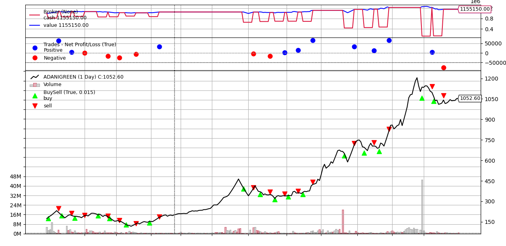

<!--Head-->
# market_strategy_tester

 

## Contents

* [What is strategy tester?](#What-is-strategy-tester?)
* [Libraries](#Libraries)
* [Description of each file](#Description-of-each-file)
* [Datasets](#Datasets)

## What is strategy tester?

The Strategy Tester allows you to test and optimize trading strategies (Expert Advisors) before using them for live trading. One can test his strategies or algorithms in historical data of any stock or crypto using this project.

## Libraries

+ [backtrader](https://www.backtrader.com) - It is an open-source framework that allows for strategy testing on historical data.
+ [DateTime](https://pypi.org/project/DateTime) - This module supplies classes for manipulating dates and times.
+ [matplotlib](https://pypi.org/project/matplotlib/) - It is a comprehensive library for creating static, animated, and interactive visualizations in Python.

<!-- Description -->
## Description of each file

1.[tester.py](https://github.com/ArunavD/market_strategy_tester/blob/master/tester.py) - This is the main method of the project where strategy is being executed.
2.[strategies.py](https://github.com/ArunavD/market_strategy_tester/blob/master/strategies.py) - Here I have created a strategy to implement as an example. The idea I have used is:
        * If not in position then, if two consicutive dip happens from a given date, buy a fixed about of stock.
        * Hold it for 5 days and sell it.

## Datasets

I have tested this with 4 datasets, 2 of them are from stock market and two of them are from crypto market. Adding them here. Other stocks historical data also can be downloaded from [yahoo finance](https://in.finance.yahoo.com/).

1. [AAPL.csv](https://github.com/ArunavD/market_strategy_tester/blob/master/AAPL.csv) - APPLE.
2. [ADANIGREEN.csv](https://github.com/ArunavD/market_strategy_tester/blob/master/ADANIGREEN.csv) - Adani Green Energy Limited.
3. [DOGE.csv](https://github.com/ArunavD/market_strategy_tester/blob/master/DOGE.csv) - DOGE coin.
4. [YFI.csv](https://github.com/ArunavD/market_strategy_tester/blob/master/YFI.csv) - YEARNFINANCE coin.